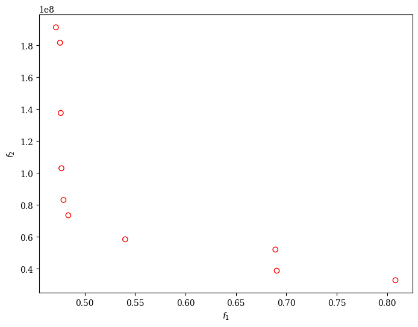

# Multiobjective optimization methodology
This folder shows an example of the automated approximation of TNN with arbitrary inputs. 
The scripts are compatible with the requirements in [requirements.txt](../requirements.txt)

```sh
cd ..
pip install -r requirements.txt
cd TNN_moo
python3 whitewine3b.py
python moo_pcc_mb.py
```


## Library of approximate components
Folder AxLibrary shows exact and approximate implementation of two-bit inputs LTGS with following ternary weights:

- whitewine3b_0: [-1, 1, -1]
- whitewine3b_1: [-1, 1, 1, -1, 1]
- whitewine3b_2: [1, -1]
- whitewine3b_3: [1, 1, -1, -1, -1, -1]
- whitewine3b_4: [1, -1, -1, -1, -1]
- whitewine3b_5: [1, -1, 1, -1, 1, -1]
- whitewine3b_6: [1, 1, -1]
- whitewine3b_7: [1, 1, -1, -1, -1]
- whitewine3b_8: [1, 1, -1, -1]


and 12-bit popcounts for the output layer.

The libraries are parsed to one pickle file for LTGS and one for Popcounts using [parse_library.py](parse_library.py).


## Evaluation of accurate implementation
This script load accurate implementation of the approximate LTGS and Popcount. These circuits are located in the folder [AxLibrary/exact](AxLibrary/exact)

```sh
python whitewine3b.py
# Training: 50.64%
# Testing: 52.18%
```

## Multiobjective optimization
Using the PyMoo library, this script creates assignments of approximate components to TNN. The components are simulated using the ArithsGen library (at CGP level).

```bash
python parse_library.py # load 
python moo_pcc_mb.py
```

## Example output of optimization

Below is an example output of the optimization process:

```plaintext
==========================================================
n_gen  |  n_eval  | n_nds  |      eps      |   indicator
==========================================================
     1 |       50 |      5 |             - |             -
     2 |      100 |      5 |  0.0647926159 |         ideal
     3 |      150 |      6 |  0.0419528960 |             f
     4 |      200 |      2 |  0.0272727273 |         ideal
     5 |      250 |      2 |  0.000000E+00 |             f
     6 |      300 |      2 |  0.000000E+00 |             f
     7 |      350 |      3 |  0.3057147235 |         ideal
     8 |      400 |      6 |  0.1090660129 |             f
     9 |      450 |      5 |  0.0609903520 |             f
    10 |      500 |      6 |  0.0260471734 |         ideal
    11 |      550 |      4 |  0.1691919801 |         nadir
    12 |      600 |      5 |  0.0446340129 |         ideal
    13 |      650 |      7 |  0.0402010050 |         ideal
    14 |      700 |      8 |  0.0083648877 |             f
    15 |      750 |      8 |  0.000000E+00 |             f
    16 |      800 |     10 |  0.1548451015 |         ideal
    17 |      850 |     10 |  0.000000E+00 |             f
    18 |      900 |     10 |  0.000000E+00 |             f
    19 |      950 |     11 |  0.0029306153 |             f
    20 |     1000 |     11 |  0.000000E+00 |             f
    21 |     1050 |     12 |  0.0093207517 |             f
    22 |     1100 |     12 |  0.0023333084 |             f
    23 |     1150 |     11 |  0.0026718683 |             f
    24 |     1200 |      8 |  0.0286629763 |             f
    25 |     1250 |      8 |  0.0261828728 |             f
    26 |     1300 |      9 |  0.0167026384 |             f
    27 |     1350 |      9 |  0.000000E+00 |             f
    28 |     1400 |      9 |  0.000000E+00 |             f
    29 |     1450 |      6 |  0.0339376089 |             f
    30 |     1500 |      6 |  0.000000E+00 |             f
    31 |     1550 |      6 |  0.000000E+00 |             f
    32 |     1600 |      6 |  0.000000E+00 |             f
    33 |     1650 |      6 |  0.0678957731 |         ideal
    34 |     1700 |      6 |  0.0064535825 |             f
    35 |     1750 |      6 |  0.000000E+00 |             f
    36 |     1800 |      7 |  0.0868719841 |         ideal
    37 |     1850 |      7 |  0.000000E+00 |             f
    38 |     1900 |      7 |  0.000000E+00 |             f
    39 |     1950 |      7 |  0.000000E+00 |             f
    40 |     2000 |      7 |  0.0095115650 |             f
    41 |     2050 |      7 |  0.000000E+00 |             f
    42 |     2100 |      7 |  0.000000E+00 |             f
    43 |     2150 |      8 |  0.0283887327 |             f
    44 |     2200 |      8 |  0.000000E+00 |             f
    45 |     2250 |      9 |  0.0073338524 |             f
    46 |     2300 |     10 |  0.0043910756 |             f
    47 |     2350 |     10 |  0.0021860714 |             f
    48 |     2400 |     10 |  0.0021860714 |             f
    49 |     2450 |     11 |  0.0376978103 |         ideal
    50 |     2500 |     10 |  0.0056597515 |             f
Best solution found: [{'circ_whitewine3b_0': 'AxLibrary/whitewine3b_0_mbstc/mae_3e-02/r.0002.cgp', 'circ_whitewine3b_1': np.str_('AxLibrary/whitewine3b_1_mbstc/mae_7e-01/r.0001.cgp'), 'circ_whitewine3b_2': np.str_('AxLibrary/whitewine3b_2_mbstc/mae_3e-02/r.0000.cgp'),...... }, ..... ]

Function value: (accuracy_drop, est_area) 
[[4.71428571e-01 1.91342169e+08]
 [4.78911565e-01 8.30929510e+07]
 [6.89115646e-01 5.20050120e+07]
 [4.76870748e-01 1.02976139e+08]
 [6.90476190e-01 3.87489350e+07]
 [4.83673469e-01 7.34899570e+07]
 [4.76190476e-01 1.37628327e+08]
 [4.75510204e-01 1.81679983e+08]
 [8.08163265e-01 3.27711550e+07]
 [5.40136054e-01 5.84155100e+07]]
 ```

 Can be shown as Pareto front (f1 is accuracy drop, f2 is estimated area)
 